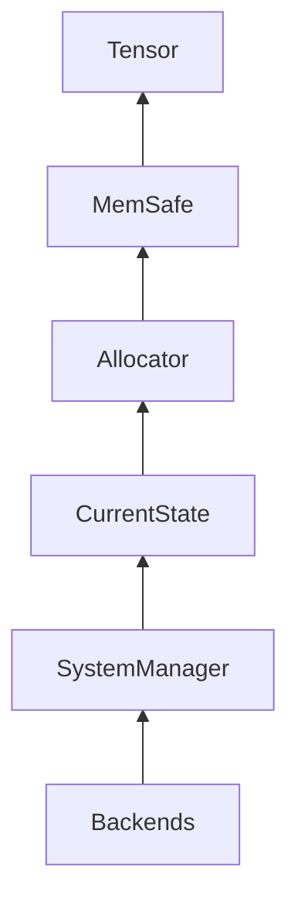
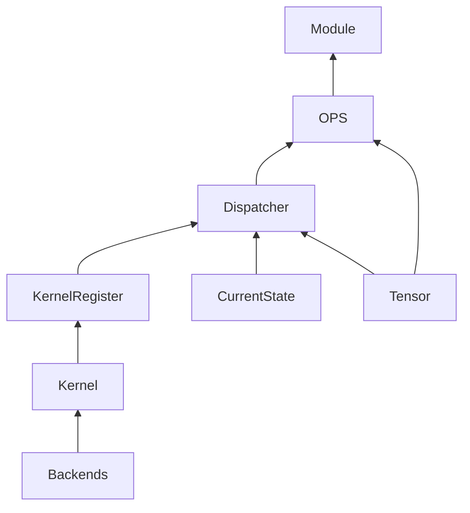
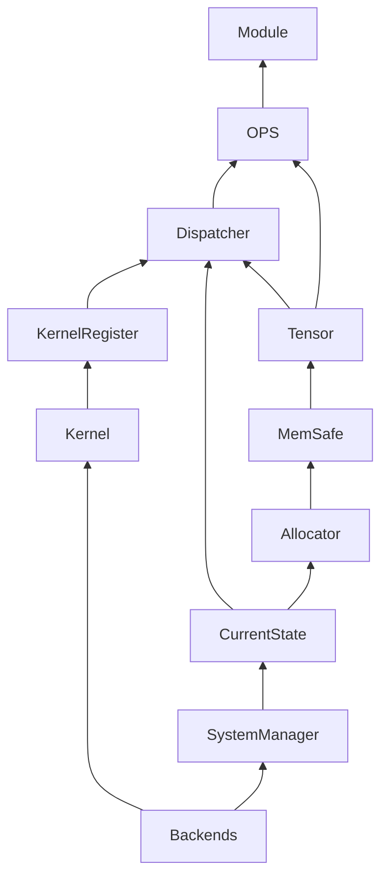

# ORTEAF コアデザイン

ORTEAF は「ユーザーが触れる API」「拡張開発者が編集できる領域」「内部実装」の三層で構成される。各層の責務と依存関係を明確に切り分け、疎結合なコンポーネント群を組み合わせている。

## レイヤリングとアクセス境界

| 層 | 主なディレクトリ | 役割 / 利用者 |
| --- | --- | --- |
| User | `include/orteaf/user` | ラッパー API。利用者は `Tensor` や `Model` を通じてフレームワークを操作する。|
| Extension | `include/orteaf/extension` | カスタム演算やストレージを追加するための抽象クラス群 (`Kernel`, `Ops`, `TensorImpl` など)。|
| Internal | `include/orteaf/internal` | 実行時制御と資源管理 (`SystemManager`, `CurrentStateImpl`, `Dispatcher`, `KernelRegister` 等)。基本的に編集禁止。|

ユーザー向け API は PImpl（実体は `extension` / `internal` 側）で提供し、所有権管理の詳細はコード側で扱う。ここではライフサイクルやスマートポインタの種類など、実装の細部には踏み込まない。

## ディレクトリマップ

```text
orteaf/
├── include/orteaf/
│   ├── user/          # ユーザーが触れるラッパー層
│   ├── extension/     # 拡張ポイント（Kernel, Ops, TensorImpl など）
│   └── internal/      # 実行基盤（SystemManager, Diagnostics 等）
└── src/
    ├── user/
    ├── extension/
    └── internal/
```

以降の図はこのレイアウトと対応している。

## コンポーネント概要

### User 層
- `Tensor` / `Parameter` / `CurrentState`：拡張層へ委譲する軽量ラッパー。
- `Module` / `Layer` / `Model`：モジュール構成を定義する基底クラス。継承してカスタム構造を構築できる。

### Extension 層
- `TensorImpl`：テンソルのストレージやレイアウト拡張ポイント。Parameter もここを経由して拡張する。
- `Kernel` と `Ops`：演算を登録・実装するための抽象クラス。
- `ModuleImpl` / `Layer` 実装：標準レイヤや Model の実相。

### Internal 層
- `SystemManager` と `CurrentStateImpl`：ランタイム初期化と状態保持。
- `Allocator` / `MemSafe`：メモリ確保と安全管理。
- `Dispatcher` / `KernelRegister`：OPS と Kernel の橋渡し。
- `Backends`：CPU / CUDA / MPS を抽象化したバックエンド。
- `Diagnostics`（`error/`, `log/`）：共通のエラー情報 (`OrteafError`)、致命的エラー (`fatal_error`) と例外ラッパーを提供し、統一的に throw / ログ / 統計連携を扱う。

## ビルド時オプション

統計機能を制御する CMake 変数を用意している。デフォルトは `OFF`（無効）。

| 変数 | 説明 |
| --- | --- |
| `ORTEAF_STATS_LEVEL` | 統計レベルの既定値（`STATS_BASIC`, `STATS_EXTENDED`, `OFF`）。 |
| `ORTEAF_STATS_LEVEL_CPU` / `ORTEAF_STATS_LEVEL_CUDA` / `ORTEAF_STATS_LEVEL_MPS` / `ORTEAF_STATS_LEVEL_CORE` | カテゴリごとの上書き（`AUTO` でグローバル設定を継承）。`CORE` にはアロケータ統計が含まれる。 |

コード側では `ORTEAF_STATS_LEVEL_*_VALUE` マクロを参照し、`STATS_BASIC(2)` または `STATS_EXTENDED(4)` に応じたメンバを有効にする。

ログ制御の CMake 変数も用意している。

| 変数 | 説明 |
| --- | --- |
| `ORTEAF_LOG_LEVEL` | ログの既定レベル（`TRACE`/`DEBUG`/`INFO`/`WARN`/`ERROR`/`CRITICAL`/`OFF`）。|
| `ORTEAF_LOG_LEVEL_CORE` / `TENSOR` / `CUDA` / `MPS` / `IO` | カテゴリごとの上書き。`AUTO` で既定値を継承。|

`ORTEAF_LOG_LEVEL_*` マクロを参照して `ORTEAF_LOG_TRACE` などのマクロがコンパイル時に無効化される。`OFF` に設定すればゼロコストでログが除去される。

## データフローと依存関係

### メモリとテンソル

SystemManager がバックエンドを立ち上げ、CurrentState が環境情報を集約する。Allocator と MemSafe がメモリを準備し、最終的に TensorImpl を通じて Tensor ラッパーへ供給する。

### 演算パイプライン

拡張層で実装された Kernel は KernelRegister へ登録され、Dispatcher が CurrentState や Tensor の情報をもとに最適な実体を選択する。OPS は Module/Layer の演算ノードとして利用される。

### 全体像

ユーザーは `Model`（= Module の集合）を操作し、内部では上記フローに従ってメモリ確保と演算が実行される。extension 層を拡張すれば Tensor 表現や Kernel を差し替えられるが、SystemManager など internal 層は既存実装を尊重する形で扱う。
