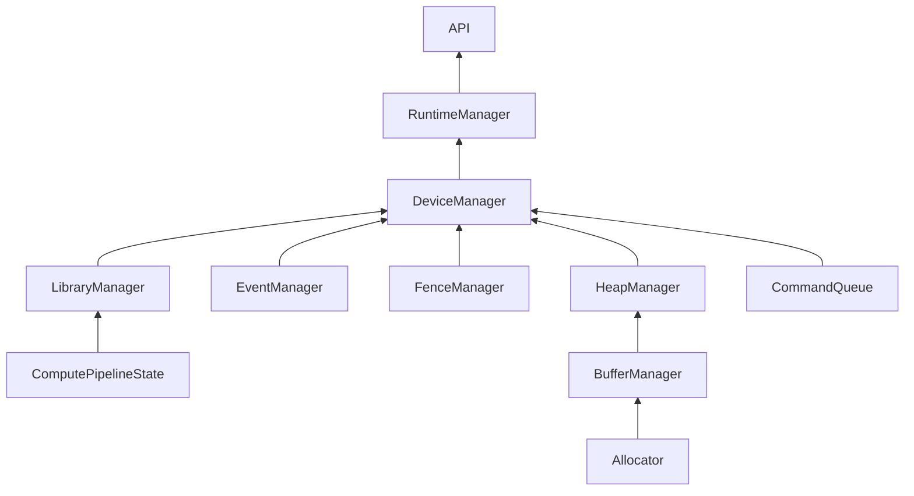

# MPS Runtime Design

この文書は「API が各バックエンド固有の差異を吸収する」という目的で設計した MPS ランタイム構成をまとめる。API 層は共通の抽象を提示し、その裏側でバックエンドごとの Manager 群が動く。Manager はそれぞれ `Lease` を保有し、対象リソースの寿命・占有ルール（単一であるべきか、複数許可か）を管理する。

## 目的と前提
- API は CPU/CUDA/MPS などの違いを隠蔽するが、中身のポリシーや制約はバックエンドごとに異なる。
- MPS バックエンドでは、各 Manager が所有する `Lease` がリソースの生存と排他を担保する。単一インスタンス強制のもの（例: `DeviceManager` のデバイス）と、並列に増やせるもの（例: バッファやフェンス）を区別する。
- 下図は MPS の Manager 間依存を示す。実装詳細や API 呼び出しの前提は図の後に列挙する。

## Manager と Lease の考え方
- `DeviceManager`：MPS デバイスを束ねる中核。デバイス自体は占有しない前提で、必要なら複数デバイスを扱える。
- `CommandQueue`：デバイス上のキューを管理。キューを乱発すると一斉に CommandBuffer が commit されるリスクがあるため、Lease は占有ポリシーで運用する。
- `LibraryManager` / `ComputePipelineState`：関数ライブラリとパイプラインを管理。パイプラインはライブラリに従属し、デバイスと一対の Lease ポリシーを採用。
- `Allocator` / `BufferManager` / `HeapManager`：メモリ確保と再利用を担当。Heap はデバイスごとに 1:N の Lease を持ち、Buffer は複数生成・解放を許容する。
- `EventManager` / `FenceManager`：同期オブジェクトを扱う。イベント・フェンスはいずれも複数 Lease を許容し、必要に応じて再発行する。

## ライフサイクル指針
- 生成と破棄は Runtime のオーケストレーション下で行い、API 呼び出し側が寿命を直接握らない。
- 単一占有を求める Lease（CommandQueue, Library）は重複生成を禁止し、再利用を強制する。
- 複数許容の Lease（Device, Buffer, Event, Fence, Heap 等）は `orteaf/include/orteaf/internal/base/shared_lease.h` による寿命管理を通じて過剰生成を抑制する。

## KernelBase と Session の責務境界
- `MpsKernelBase` は「カーネルキーと device ごとの pipeline lease キャッシュ」のみを責務に持つ。
- `MpsKernelSession` は RAII でコマンド発行のライフサイクル（begin/finish）を担う。
  - `begin` 途中失敗時に中間ハンドルを回収し、`finish` で `endEncoding/commit` 後に encoder / command buffer を解放する。
- `MpsKernelSessionOps` はバインド・dispatch・同期トークン更新など、実行時オペレーションのユーティリティを担う。
- 実装上は `MpsKernelSessionOps` の同期処理を `mps_kernel_session_sync_ops.h` に分離し、依存の重い処理を局所化する。
- 運用ルールとして、新しい「便利メソッド」は `MpsKernelBase` に追加せず、`MpsKernelSessionOps` またはその detail ヘッダへ追加する。
