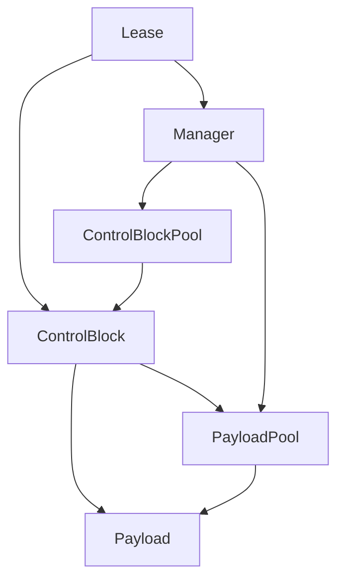
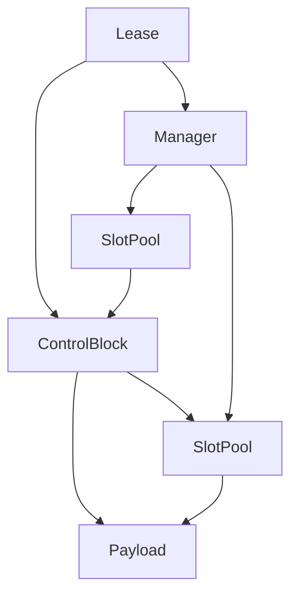

# Slot Pool + Control Block Design Notes

## 目的
- pool は再利用とストレージ管理に専念する。
- control block は寿命管理に専念する。
- manager は control block を束ねる唯一の窓口として振る舞う。

## 責務の分離
- **Pool**
  - handle 管理、generation、isCreated の安全確認
  - スロット再利用（freelist）
  - 寿命判断は行わない
- **Control Block**
  - 参照カウントと寿命判断
  - payload へのアクセス情報を保持
- **Manager**
  - control block の集合
  - 取得/解放フローの入口

## データ配置の方針
- Pool は SoA で管理する:
  - `payloads[]`
  - `generations[]`
  - `is_created[]` (uint8_t; 将来 bit 化予定)
  - `freelist[]`

## pointer 最適化（速度優先）
- control block は以下を保持する:
  - payload の `handle` と `payload ptr`
  - 必要に応じて generation（検証用途）
  - payload pool への非所有ポインタ
- pool の寿命は manager と一致する。
  - manager が payload pool と control block pool を所有するため、
    control block より pool の寿命は必ず長い。
- control block は pool に対して **解放要求のみ** を行う。
  - pool の内部状態（freelist 等）には触れない。
  - 最終的な安全判定は pool 側が行う。

## 取得フロー（概要）
1. payload pool から未使用の payload を取得（handle + ptr）。
2. control block pool から未使用の control block を取得。
3. control block に payload 情報を格納。
4. lease は control block への参照を保持して返る。

## 利用フロー（概要）
- lease -> control block -> payload ptr で直接アクセス。

## Lease の役割
- lease は **control block へのアクセス権** を表す軽量ハンドル。
- lease 自身は payload を所有しない。
- lease が保持するもの:
  - control block の handle と ptr
  - manager への ptr（必要に応じて解放経路のため）
- lease の有効性は control block 側の世代/カウントに依存する。

## 解放フロー（概要）
1. control block の ref count を減算。
2. 0 になったら payload pool に `tryRelease(handle)` を要求。
3. pool は generation / isCreated / 範囲チェックを行い、
   OK なら再利用に戻す。
4. control block 自身も同様に pool に返す。

## 不変条件
- pool は寿命管理をしない（再利用の器に徹する）。
- 寿命判断は control block に集約する。
- 解放の最終判定は pool が行う。
- isCreated は manager 側が意味づけと更新を行う（pool は保持のみ）。
- in_use は control block 側で管理し、pool は関知しない。

## SlotPool のメソッド案
- 取得: `acquire(request, context)` または `tryAcquire(request, context)`
  - index / generation / payload_ptr を返す小さな構造体を返却
- 返却: `release(handle)` または `tryRelease(handle)`
  - freelist に戻す（pool が安全チェックを行う）
- 参照: `get(handle)` / `payload(handle)`
  - handle から payload ptr を返す

## 依存関係（概念）

## 依存関係（テンプレート具体化の例）

