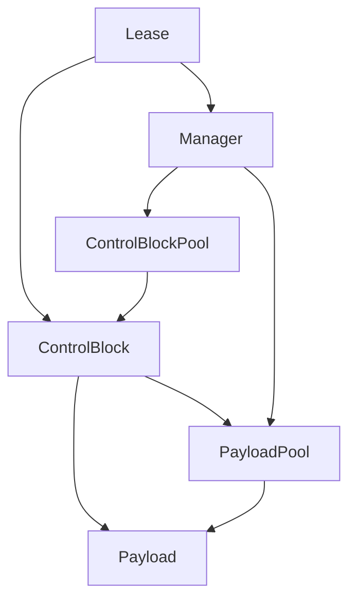
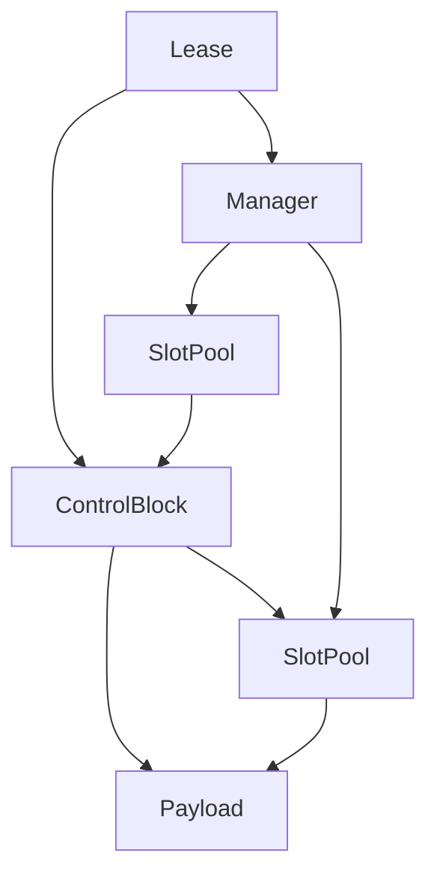

# Slot Pool + Control Block Design Notes

## 目的
- pool は再利用とストレージ管理に専念する。
- control block は寿命管理に専念する。
- manager は control block を束ねる唯一の窓口として振る舞う。

## 責務の分離
- **Pool**
  - handle 管理、generation、isCreated の安全確認
  - スロット再利用（freelist）
  - 生成/破棄の方針は Traits に従う（pool 内で完結）
  - 寿命判断は行わない
- **Control Block**
  - 参照カウントと寿命判断
  - payload へのアクセス情報を保持
- **Manager**
  - control block の集合
  - 取得/解放フローの入口

## データ配置の方針
- Pool は SoA で管理する:
  - `payloads[]`
  - `generations[]`
  - `is_created[]` (uint8_t; 将来 bit 化予定)
  - `freelist[]`

## pointer 最適化（速度優先）
- control block は以下を保持する:
  - payload の `handle` と `payload ptr`
  - 必要に応じて generation（検証用途）
  - payload pool への非所有ポインタ
- pool の寿命は manager と一致する。
  - manager が payload pool と control block pool を所有するため、
    control block より pool の寿命は必ず長い。
- control block は pool に対して **解放要求のみ** を行う。
  - pool の内部状態（freelist 等）には触れない。
  - 最終的な安全判定は pool 側が行う。

## 取得フロー（概要）
1. payload pool から未作成の slot を reserve（handle + ptr）。
2. control block pool から未使用の control block を取得。
3. control block に payload 情報を格納。
4. lease は control block への参照を保持して返る。

## isCreated と生成/破棄方針
- isCreated は payload の中身が「構築済みか」を示す。
- reserve は isCreated=false の slot のみ返す。
- acquire は isCreated=true の slot のみ返す。
- pool の Traits が生成/破棄の方針を持つ:
  - `destroy_on_release = true` の場合、release で destroy し isCreated を false に戻す。
  - `destroy_on_release = false` の場合、release では destroy せず isCreated を維持する。
- acquire の挙動も Traits に従う:
  - `destroy_on_release = true` を前提とする pool では、isCreated=false のときだけ create を許可し、
    isCreated=true ならエラー扱いとする（毎回生成のモード）。
  - `destroy_on_release = false` を前提とする pool では、isCreated=false なら create、
    isCreated=true なら再利用する（再利用モード）。

## 利用フロー（概要）
- lease -> control block -> payload ptr で直接アクセス。

## Lease の役割
- lease は **control block へのアクセス権** を表す軽量ハンドル。
- lease 自身は payload を所有しない。
- lease が保持するもの:
  - control block の handle と ptr
  - manager への ptr（必要に応じて解放経路のため）
- lease の有効性は control block 側の世代/カウントに依存する。

## 解放フロー（概要）
1. control block の ref count を減算。
2. 0 になったら payload pool に `tryRelease(handle)` を要求。
3. pool は generation / isCreated / 範囲チェックを行い、
   OK なら再利用に戻す（Traits に従い destroy を行う）。
4. control block 自身も同様に pool に返す。

## 不変条件
- pool は寿命管理をしない（再利用の器に徹する）。
- 寿命判断は control block に集約する。
- 解放の最終判定は pool が行う。
- isCreated の更新は pool が Traits に従って行う。
- in_use は control block 側で管理し、pool は関知しない。

## SlotPool のメソッド案
- 予約: `reserve(request, context)` または `tryReserve(request, context)`
  - 未作成の slot を返す（isCreated=false のみ）
- 取得: `acquire(request, context)` または `tryAcquire(request, context)`
  - 作成済み slot を返す（isCreated=true のみ）
- 初期化/終了: `initialize(config)` / `shutdown()`
  - `initialize` は内部で `shutdown` と `grow` を行う
- 初期化+作成: `initializeAndCreate(config, request, context)`
  - `initialize` 後に全 slot を作成する
- 拡張: `grow(config)` / `growAndCreate(config, request, context)`
  - `grow` は未作成 slot を追加する
  - `growAndCreate` は新規 slot を create し、作成済みとして追加する
- 返却: `release(handle)` または `tryRelease(handle)`
  - freelist に戻す（pool が安全チェックと destroy 方針を適用）
- 参照: `get(handle)` / `payload(handle)`
  - handle から payload ptr を返す
- 生成/破棄:
  - `emplace(handle, request, context)`（Traits::create を呼ぶ）
  - `destroy(handle, request, context)`（Traits::destroy を呼ぶ）

### 例外/戻り値の方針
- `try*` 系は `bool` を返す（失敗は通常系）。
- `*` ラッパは `try*` に委譲し、失敗時に `throw` する。
- `release` は二重解放などを検出しても例外を投げず、`bool` で失敗を返す。
  - 必要ならラムダ版で上書きできる

## 最小 Manager の構成案
- manager は以下を所有する:
  - `payload_pool`
  - `control_block_pool`
- `acquire` の流れ:
  1. payload_pool から SlotRef を取得
  2. control_block_pool から SlotRef を取得
  3. control block に payload 情報を `tryBindPayload` で設定
  4. lease を生成して返す（control block ptr + handle + manager ptr）
- `release` の流れ:
  1. control block の強参照を減算
  2. last strong なら control block が payload_pool に `release(handle)` を要求
  3. control block 自身は control_block_pool に返す
- 失敗時の後始末:
  - payload_pool の取得に失敗 → 即失敗
  - control_block_pool の取得に失敗 → payload を pool に返す

## pool 不要ケース（weak only / system lifetime）
- 再利用が不要なケースでは `FixedSlotStore` を用意する。
- `FixedSlotStore` は **配列に収めるだけ** で、freelist による再利用をしない。
- `FixedSlotStore` は `SlotPool` と同じメソッド形状を持つ:
  - `initialize(config)`（配列確保）
  - `acquire(request, context)`（外部で指定された slot に bind）
  - `release(handle)`（no-op または無効化のみ）
  - `get(handle)`（配列から直接参照）
- manager は pool 実装を差し替えるだけで共通化できる。

### FixedSlotStore の型（暫定）
- Config
  - `capacity`
- Request
  - `handle`（index 指定）
- Context
  - 空

### SlotPool の型（暫定）
- Config
  - `capacity`
- Request
  - 空（将来拡張用に残す）
- Context
  - 空

## FixedSlotStore の生成方針
- payload は **pool 内で構築**する（コピー/ムーブ回避）。
- `Request` に `handle` を含めて index 依存の生成を可能にする。
- `Traits::create/destroy` を基本にし、特殊ケースはラムダで上書き可能にする。
  - `emplace(handle, request, context, create_fn)` の形を想定。

## 依存関係（概念）

## 依存関係（テンプレート具体化の例）

## Control Block 方針（新）
- ControlBlock は payload へのアクセス情報を保持する:
  - `payload_handle`
  - `payload_ptr`
  - `payload_pool*`（非所有）
- generation の管理は **pool 側** が唯一の責務。
  - ControlBlock は generation を検証用途に依存しない。
- ControlBlock は **CB pool の payload** として配置される。
- 参照カウントは atomic を使用する。

### 種別ごとの責務
- WeakControlBlock
  - weak_count のみを atomic で保持
  - payload の寿命は外部で管理し、control block の寿命のみ扱う
  - `payload_handle / payload_ptr / payload_pool*` を保持
- SharedControlBlock
  - strong_count を atomic で保持
  - payload と control block の寿命を共有で扱う
  - `acquire/release` は atomic
- WeakSharedControlBlock
  - strong_count と weak_count を atomic で保持
  - `tryPromote / releaseWeak` を持つ
